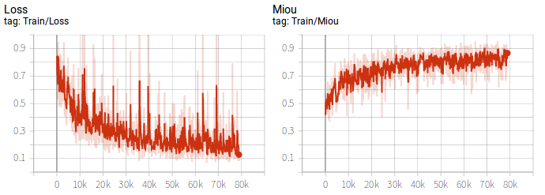
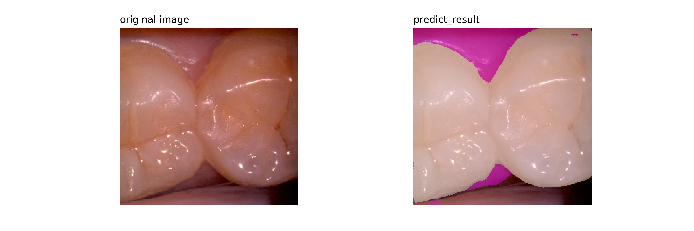
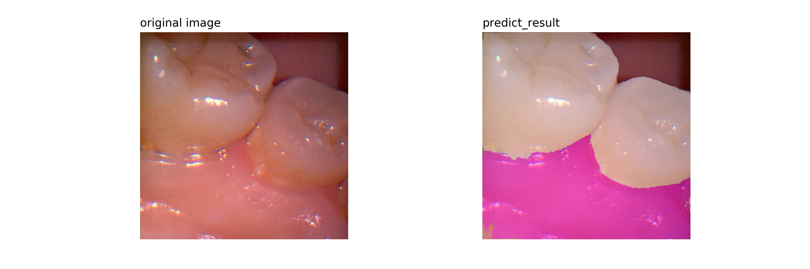

# Separable-U_Net
## Model 
>>I modified the u_net model named separable-u_net

>> reference the Mobilenet model, I use the separable convolution into unet.

## Environment
>> If you want to implement this project.the environment need build as follow:

>>>> python==3.6 

>>>> torch==1.1.0

>>>> numpy

>>>> matplotlib

>>>> tensorboardX

## Script interpret

>> The script dataprocess.py is for data read,it's actually a iterable.

>> The script metrics.py is defined miou.

>> The script model_dw.py is the modified unet called separable-unet.

>> The script train.py is for train the model.

>> The script visual_res.py is for visualize the model test result.

## Train 
>> I trained 30 epochs.bitch size is 3.
>> when you establish the environment,then can implement this project in terminal by "python train.py"

>> **Train loss and Train miou：**

>> **Valid loss and Valid miou：**

<src=images/2.png/>

## Visual
>> **Segmentation result:**

## Analysis
>> There are still many improvements can use in this project, I just attempt to use separable convolution, dilate convolution and residual structure to unet. The result is better than original unet in my datasets. And the final use of the model is linear output, adding the sigmiod activate function may be better. The epoch of model training is less, and the effect of continuing training may be better.

## Attention
>> The project was completed by me independently for academic exchange. For commercial use, please contact me by email an_chao1994@163.com.

